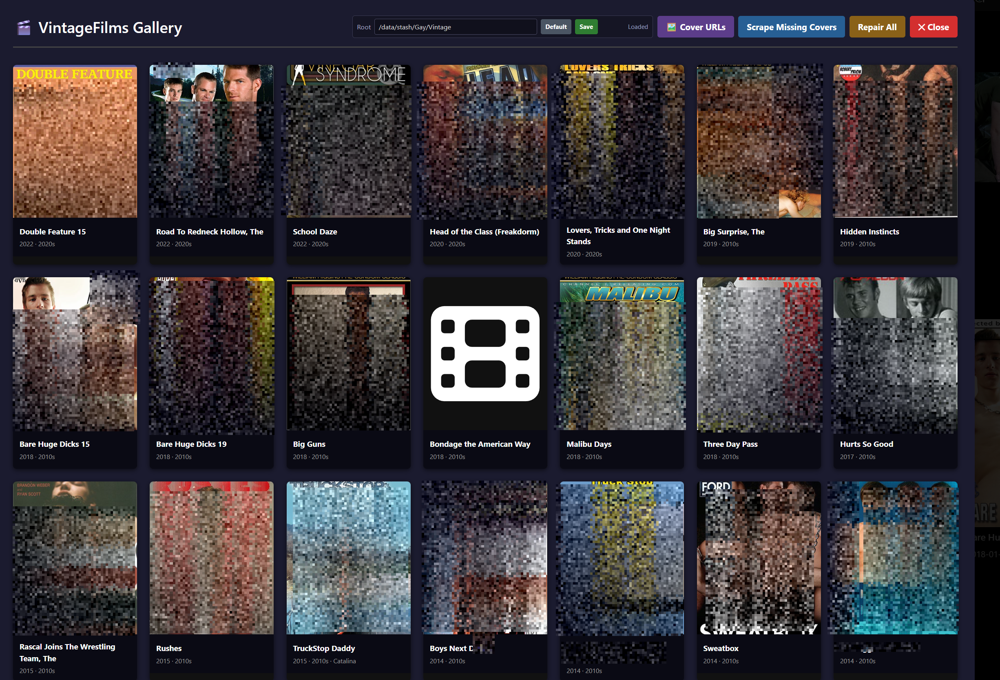
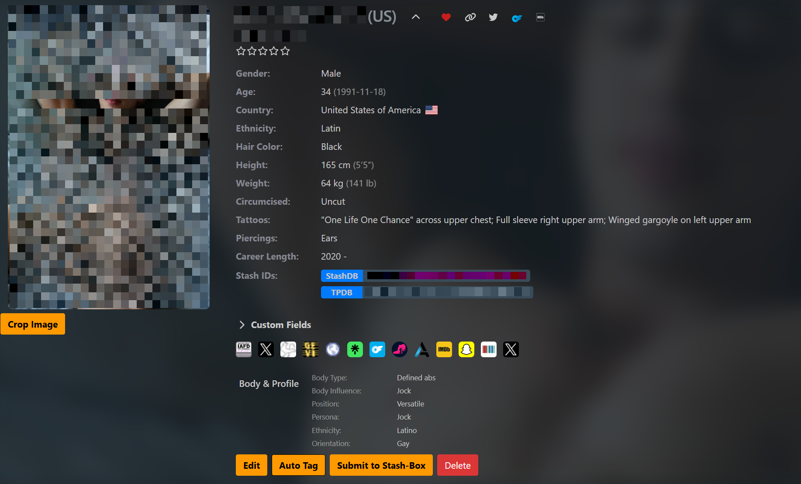

# OpieTaylor's Stash Plugins


> Plugins for [Stash](https://github.com/stashapp/stash) focused on gay content management.
> Most existing plugins are written for straight libraries or don't cover my use cases — so I'm building my own and sharing them. Use at your own risk.

---

## Source Index URL

Add this URL in Stash under **Settings → Plugins → Add Source**:

```
https://opietaylor911.github.io/StashPlugins/main/index.yml
```

---

## Plugins

### 🎞️ Decade Tagger `v1.0`

Tags scenes with decade tags like `Filmed-1990s`, `Filmed-1980s`, etc.

- Only tags when the year is **certain** — from a scraped/set scene date, or a 4-digit year in the filename (e.g. `(1995)`, `[1985]`, `.1978.`, `_1974_`)
- Adds a **Decades** dropdown to the Stash navbar for quick decade browsing
- **Hook:** Auto-tags on Scene Create and Scene Update
- **Task:** `Re-Decade All Scenes` — bulk apply/fix decade tags across your library

---

### 🎬 Vintage Films `v1.0`

Links vintage scenes to Movie records and enriches them with metadata from TPDB and AEBN.

**Two file layout modes:**
- **Mode A** — Scenes directly in `/Gay/Vintage` (or decade subfolders `1970s`–`2000s`) → one Movie per file
- **Mode B** — Scenes in a named subfolder under `/Gay/Vintage` → one Movie per folder, scene index from the leading digit in the filename

**Metadata sources:** TPDB (title + year lookup with orientation scoring: gay → bi → straight) and AEBN scraping fallback (covers, categories as tags, performers).

**Hook:** Auto-links newly scanned or updated vintage scenes.

**Tasks:**
| Task | Description |
|---|---|
| Process All Vintage Films | Scan all scenes, create Movie records and link scenes. Safe to re-run. |
| Repair Vintage Metadata | Re-evaluate linked movies against TPDB strict vintage rules; clear bad metadata. |
| Scrape Missing Covers | Scrape cover art from AEBN (with TPDB fallback) for movies missing a front cover. |

**Settings:**
- `Vintage Root Path` — absolute container path to your vintage files root

---

### 🧑 Performer Body Fields `v1.0`

Adds extended editable fields to the performers list page:

- Body Type, Body Influence, Position, Persona, Ethnicity, Orientation

Fields are stored as **performer custom fields** and are fully editable inline.

---

### ✂️ Performer Cut/Uncut Badge `v1.0`

Overlays a small **cut** or **uncut** badge on performer card images based on their circumcised status.

- Requires the `stashUserscriptLibrary` community plugin

---

### 📥 Vintage Performer Import `v0.1`

Imports vintage performers from a name list or CSV file, then enriches each with profile stats and images from source sites.

**Input modes:**
- Newline-separated names entered directly in settings
- CSV file (with configurable column name)
- Source list URL (e.g. a CocksuckersGuide toplist page)

**Settings:**
| Setting | Description |
|---|---|
| Source List URL | URL of a performer list page to scrape names from |
| Performer Names | Newline-separated names (used before CSV) |
| CSV Path | Container path to a CSV file |
| CSV Name Column | Column name containing performer names |
| Update Existing | Enrich existing performers when source data is found |
| Overwrite Details | If off, imported details are appended rather than replaced |
| Overwrite Image | If off, only performers missing an image are updated |
| Dry Run | Log planned actions without writing any changes |
| HTTP Timeout | Timeout in seconds for source HTTP requests |

**Task:** `Import Vintage Performers`

---

## Requirements

- [Stash](https://github.com/stashapp/stash) v0.25+
- Python 3 available in the Stash container
- `Performer Cut/Uncut Badge` requires the [stashUserscriptLibrary](https://github.com/stashapp/CommunityScripts) community plugin

---

## License

[AGPL-3.0](LICENCE)
